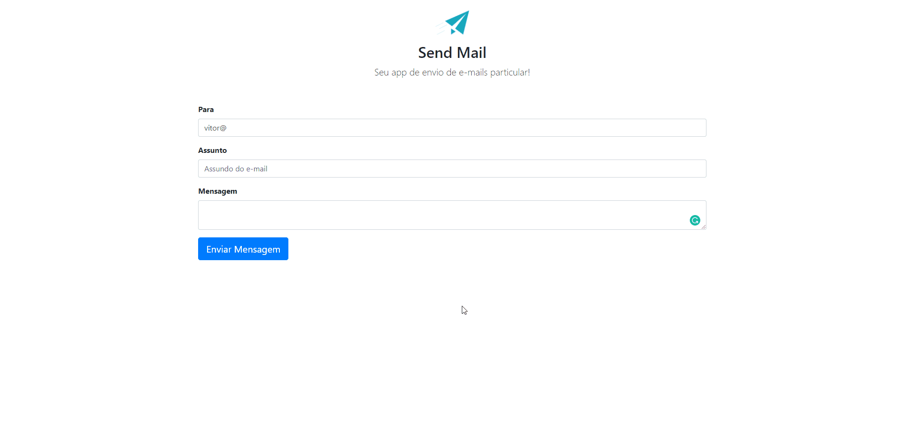

<h2 align="center">
App Send Mail
</h2>

  

<h3 align="center">  
  <a href="#information_source-sobre">Sobre</a> |
  <a href="#interrobang-motivo">Motivo</a> | 
  <a href="#rocket-tecnologias-utilizadas">Tecnologias</a> |  
</h3>

## :information_source: Sobre

Aplicação capaz de enviar emails ao destinatário via protocolo SMTP utilizando a biblioteca PHP Mailer.

## :interrobang: Motivo

O motivo do desenvolvimento da aplicação de Send Mail, foi treinar e fixar estudos sobre as namespaces e libs do PHP, em foco temos a biblioteca de envio de e-mails PHP Mailer.

## :rocket: Tecnologias Utilizadas

O projeto foi desenvolvido utilizando as seguintes tecnologias

- HTML
- CSS (framework Bootstrap)
- PHP
- Biblioteca PHP Mailer